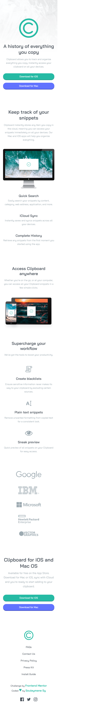
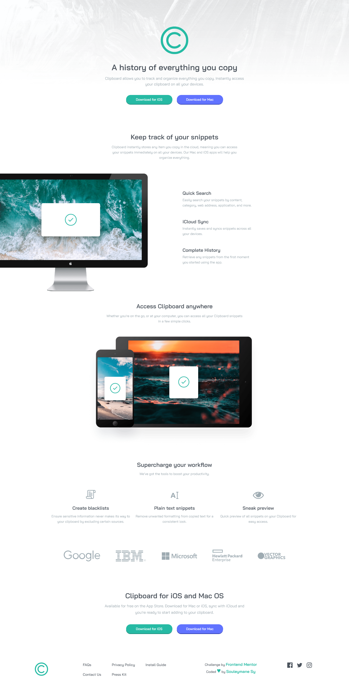

# Frontend Mentor - Clipboard landing page

## Welcome! 👋

Thanks for checking out this front-end coding challenge.

This is a solution to the [Clipboard landing page challenge on Frontend Mentor](https://www.frontendmentor.io/challenges/clipboard-landing-page-5cc9bccd6c4c91111378ecb9).

[Frontend Mentor](https://www.frontendmentor.io) challenges help you improve your coding skills by building realistic projects.

## Table of contents

- [The challenge](#the-challenge)
- [Screenshot](#screenshot)
- [My process](#my-process)
- [Built with](#built-with)
- [What I learned](#what-i-learned)
- [Author](#author)

## The challenge

The challenge is to build out this landing page and get it looking as close to the design as possible.

Users should be able to:

- View the optimal layout for the site depending on their device's screen size
- See hover states for all interactive elements on the page

## Screenshot

This is the Screenshot of my work!

### Mobile

### Desktops

### Links

- Solution URL: [solution URL here](https://www.frontendmentor.io/solutions/clipboard-landing-page-responsive-html-sass-vite-WTX11gpPP-)
- Live Site URL: [live site URL here](https://fem-clipboard-landing-page-omega.vercel.app/)

## My process

I Made this projects with HTML and Vanilla CSS (SASS). I used Vite for the projects managements!

### Built with

- Semantic HTML5 markup
- SASS
- CSS custom properties
- Flexbox
- Mobile-first workflow
- Vite
- NPM

### What I learned

I Learned to work with Vite. Vite is so easy to learn and it's very fast.

## Author

- GitHub - [Souleymane Sy](https://github.com/SouleymaneSy7)
- Frontend Mentor - [@SouleymaneSy7](https://www.frontendmentor.io/profile/SouleymaneSy7)
- Twitter - [@Souleymanesy43](https://twitter.com/Souleymanesy43)
